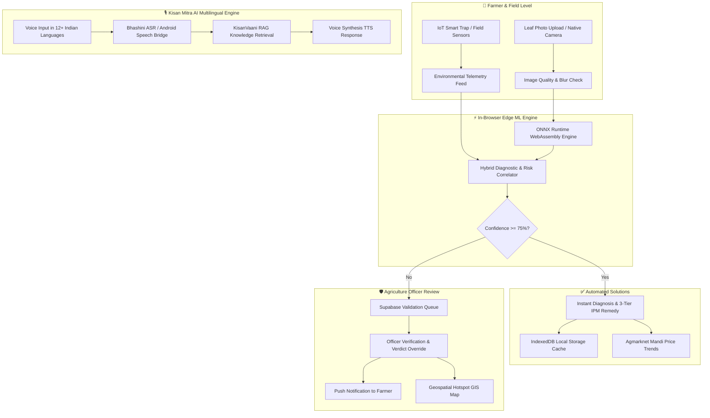

# 🌾 KrishiRakshak AI (कृषि रक्षक AI)
### Autonomous Edge-ML Crop Health Sentinel, IoT Pest Surveillance & Geospatial Outbreak Command Center

[](https://nextjs.org/)
[](https://react.dev/)
[](https://capacitorjs.com/)
[](https://onnxruntime.ai/)
[](https://tailwindcss.com/)
[](https://supabase.com/)
[](#license)

**KrishiRakshak AI** is an intelligent, local-first agricultural defense platform designed for Indian farming communities and agricultural extension departments. It merges **in-browser Edge Computer Vision (ONNX Runtime)**, **autonomous IoT smart trap telemetry**, **micro-climate meteorological risk indices**, **spatial GIS outbreak clustering**, and **Bhashini multilingual voice RAG** into an offline-resilient ecosystem accessible on both web and native Android APK.

---

## 📌 Table of Contents
- [Key Features & Capabilities](#-key-features--capabilities)
- [System Architecture & Workflow](#-system-architecture--workflow)
- [Tech Stack Overview](#-tech-stack-overview)
- [Repository Structure](#-repository-structure)
- [Getting Started (Quick Run)](#-getting-started-quick-run)
  - [Prerequisites](#prerequisites)
  - [1. Clone & Install Dependencies](#1-clone--install-dependencies)
  - [2. Environment Variables](#2-environment-variables)
  - [3. Run Web App Locally](#3-run-web-app-locally)
- [Mobile App (Android APK) Build Guide](#-mobile-app-android-apk-build-guide)
- [Machine Learning & RAG Knowledge Base](#-machine-learning--rag-knowledge-base)
- [Authentication & Roles](#-authentication--roles)
- [Database Setup (Supabase)](#-database-setup-supabase)
- [Contributor Guidelines](#-contributor-guidelines)
  - [Workflow & Branching Strategy](#workflow--branching-strategy)
  - [Coding Standards](#coding-standards)
  - [Submitting Pull Requests](#submitting-pull-requests)
- [License & Acknowledgements](#-license--acknowledgements)

---

## 🚀 Key Features & Capabilities

### 1. 🌿 Edge ML Leaf Pathogen & Pest Health Scanner (`/detect`)
- **Zero-Latency In-Browser Inference**: Runs quantized ONNX models (`model.onnx` for foliar diseases, `pest-model.onnx` for 102-class insect pests) directly on the device using WebAssembly (`ort-wasm`).
- **ResNet-50 IP102 102-Class Pest Sentinel**: Classifies **102 agricultural insect pest species** (Rice stem borers, Planthoppers, Armyworms, Aphids, Weevils, Fruit flies, Cutworms, Mites, Thrips, Beetles) based on the benchmark IP102 dataset with in-browser offline inference.
- **Open-Set Pathogen Classifier**: Diagnoses 50+ crop diseases across Tomato, Potato, Wheat, Rice, Cotton, and Maize with image quality validation (blur/glare filters).
- **Hybrid Decision Engine**: Fuses visual classification with local weather signals and micro-climate sensor telemetry to minimize false positives.
- **Low-Confidence Human Escalation**: Scans with $<75\%$ confidence automatically queue for official review by agricultural officers.

### 2. 🐛 Autonomous IoT Smart Pest Trap Surveillance (`/surveillance`)
- Real-time telemetry feed from field sensor nodes and solar-powered IR optical insect traps.
- Automated catch counting and species identification (Bollworms, Aphids, Planthoppers).
- Automated **Economic Threshold Level (ETL)** alerts and 7-day population growth forecasting.

### 3. 🌦️ Micro-Climate Meteorological Risk Forecast (`/forecasting` & `/environmental-risk`)
- 5-Day predictive outbreak risk index computed from canopy temperature, soil moisture, relative humidity, and regional weather APIs.
- Early warning indices for Fungal Blight, Powdery Mildew, and Rust before symptoms appear on foliage.

### 4. 🗺️ Regional Outbreak GIS Hotspot & Mesh Map (`/map`)
- Interactive Leaflet-powered geospatial map for Agriculture Officers and regional administrators.
- Real-time hotspot clustering, community field scan nodes, and pest corridor vector rendering.

### 5. 📊 Live Agmarknet Mandi Commodity Price Tracker (`/dashboard/farmer`)
- Up-to-the-minute crop commodity market prices across regional mandis (INR/Quintal).
- 30-Day price trends and multi-crop market comparison with offline caching.

### 6. 🌾 Kisan Mitra AI Multilingual Voice Assistant (RAG Chatbot)
- **Voice-to-Text (Mic)**: Native Android speech recognition bridge (`RecognizerIntent`) and browser Web Speech API across Indian languages (Hindi, Bengali, English, Telugu, Tamil, Marathi).
- **Text-to-Speech (Speak)**: Native Android offline Text-to-Speech (`android.speech.tts.TextToSpeech`) and web speech fallback.
- **KisanVaani RAG Knowledge Base**: High-accuracy retrieval over agronomy guidelines, remedies, and Integrated Pest Management (IPM).

---

## 🏛 System Architecture & Workflow



---

## 🛠 Tech Stack Overview

| Layer | Technologies |
| :--- | :--- |
| **Frontend Framework** | [Next.js 16 (App Router)](https://nextjs.org/), [React 19](https://react.dev/), [TypeScript 5](https://www.typescriptlang.org/) |
| **Styling & UI** | [Tailwind CSS 4](https://tailwindcss.com/), Lucide Icons, Glassmorphic Modern Dark Theme |
| **Mobile Runtime** | [Capacitor 8](https://capacitorjs.com/) (Android Native Java Bridge + Android WebView) |
| **Edge Machine Learning** | [ONNX Runtime Web](https://onnxruntime.ai/) (WASM / SIMD / WebGL), PyTorch 2, ResNet-50 (IP102 102-Class Benchmark), MobileNetV3 |
| **Mapping & GIS** | [Leaflet](https://leafletjs.com/), [React Leaflet 5](https://react-leaflet.js.org/) |
| **Database & Auth** | [Supabase](https://supabase.com/) (PostgreSQL + pgvector + RLS + Realtime) with LocalStorage / IndexedDB v2 fallback |
| **Multilingual AI** | Government of India Bhashini (ULCA / Dhruva), Web Speech API, Android `RecognizerIntent` & `TTS` |
| **Analytics & Charts** | [Recharts 3](https://recharts.org/), Chart.js |

---

## 📁 Repository Structure

```text
KrishirakshaAI/
├── android/                             # Native Android Studio project (Capacitor 8)
│   ├── app/src/main/
│   │   ├── AndroidManifest.xml          # Native permissions (Audio, Camera, GPS)
│   │   ├── java/com/krishirakshak/ai/
│   │   │   └── MainActivity.java        # Native Speech Recognizer & TTS Bridge
│   │   └── res/                         # App icons, splash screens, adaptive drawables
│   └── gradlew.bat                      # Gradle wrapper for Android APK compilation
├── public/
│   ├── icons/                           # PWA & Web icons (192x192, 512x512)
│   ├── ort-wasm/                        # ONNX Runtime WebAssembly binaries
│   ├── kisanvaani_rag_kb.json           # Embedded KisanVaani RAG Knowledge Base (22,615 Q&As)
│   ├── model.onnx                       # 19/38-class Crop Leaf Disease ONNX model
│   ├── pest-model.onnx                  # 102-class Insect Pest ONNX model (ResNet-50 IP102, quantized INT8, ~22.8 MB)
│   ├── pest-model-fp32.onnx             # 102-class ResNet-50 ONNX model (Full FP32 precision, ~90.4 MB)
│   ├── pest_model_metadata.json         # 102-class taxonomy, normalization, and model metadata
│   └── logo.png / logo-shield.png       # Official KrishiRakshak AI branding assets
├── build_kisanvaani_rag_kb.py           # 22k KisanVaani RAG compiler & ChatML dataset generator
├── train_krishibani_llm.py              # LLM fine-tuning pipeline for 22k KrishiBani dataset
├── convert_resnet50_to_onnx.py          # PyTorch to ONNX exporter & dynamic INT8 quantizer
├── resnet50_0.497.pkl                   # Pre-trained ResNet-50 IP102 checkpoint
├── scripts/
│   ├── build-mobile.mjs                 # Mobile pipeline: Next.js export + Cap Sync
│   └── generate_app_assets.py           # Generates all icon & splash screen densities
├── src/
│   ├── app/                             # Next.js App Router
│   │   ├── dashboard/                   # Role-specific Farmer & Officer portals
│   │   ├── detect/                      # Leaf health scanner & pest detector
│   │   ├── environmental-risk/          # Sensor telemetry correlation engine
│   │   ├── forecasting/                 # 5-Day micro-climate outbreak predictor
│   │   ├── ipm/                         # Integrated Pest Management handbook
│   │   ├── login/                       # Secure unified login & role switch
│   │   ├── map/                         # Spatial outbreak hotspot GIS mesh map
│   │   ├── surveillance/                # Smart optical insect trap monitor
│   │   ├── layout.tsx                   # App shell, PWA init, Language & Auth gates
│   │   └── page.tsx                     # Landing page & feature showcase
│   ├── components/                      # Reusable UI widgets (Header, Chatbot, Gates)
│   ├── context/                         # React Contexts (AuthContext, LanguageContext, OfflineContext)
│   └── utils/                           # Core utilities
│       ├── bhashiniService.ts           # Speech Synthesis & Translation engine
│       ├── db.ts                        # IndexedDB local storage offline queue
│       ├── environmentalDiseaseModel.ts # Micro-climate risk index calculator
│       ├── hybridEngine.ts              # Visual + sensor fusion scoring
│       ├── imageClassifier.ts           # ONNX pipeline & bounding box projection
│       ├── nativeBridge.ts              # Capacitor camera, GPS & network bridges
│       ├── ragEngine.ts                 # Vector similarity & question retrieval
│       └── supabase.ts                  # Supabase client & local mock storage fallback
├── capacitor.config.ts                  # Capacitor mobile application configuration
├── next.config.ts                       # Next.js build & static export rules
├── supabase-schema.sql                  # PostgreSQL schema with Row-Level Security
├── KrishiRakshak-AI.apk                 # Pre-built installable Android debug APK
└── package.json                         # Project dependencies & scripts
```

---

## ⚡ Getting Started (Quick Run)

### Prerequisites
Make sure your workstation has:
- **Node.js**: `v18.17.0` or higher (Node 20+ recommended)
- **Package Manager**: `npm` (comes with Node)
- **Git**: Installed and configured
- **Python** *(Optional, for ML retraining)*: `3.10+` with PyTorch & ONNX
- **Android Studio & JDK 17** *(Optional, for building the APK)*

### 1. Clone & Install Dependencies
```bash
git clone https://github.com/your-username/KrishirakshaAI.git
cd KrishirakshaAI

# Install frontend and native dependencies
npm install
```

### 2. Environment Variables
Create a `.env.local` file in the project root:
```env
# Supabase (Optional for local testing; app includes offline demo mock fallback)
NEXT_PUBLIC_SUPABASE_URL=https://your-project.supabase.co
NEXT_PUBLIC_SUPABASE_ANON_KEY=your-supabase-anon-key

# Bhashini Cloud API (Optional - built-in Web Speech & Neural fallback included)
BHASHINI_API_KEY=your-bhashini-api-key
BHASHINI_USER_ID=your-bhashini-user-id
```
> **Note**: Even if `.env.local` is empty or missing, KrishiRakshak AI features a **Local-First Mock Engine** allowing you to test all portal features, scan crops, and sign in offline!

### 3. Run Web App Locally
```bash
npm run dev
```
Open your browser and navigate to:
```text
http://localhost:3000
```

---

## 📱 Mobile App (Android APK) Build Guide

KrishiRakshak AI is built using **Capacitor 8**, enabling the web application to run as a native Android app with offline storage, camera access, and hardware-accelerated speech services.

### 1. Export Web Production Bundle & Sync
```bash
npm run build:mobile
```
This runs Next.js static export (`out/`) and automatically synchronizes all web assets and plugins into the Android native project (`android/app/src/main/assets/public`).

### 2. Compile Debug APK via Command Line
On Windows (Command Prompt / PowerShell):
```powershell
cd android
.\gradlew.bat assembleDebug
```
On macOS / Linux:
```bash
cd android
./gradlew assembleDebug
```
The compiled APK will be output to:
```text
android/app/build/outputs/apk/debug/app-debug.apk
```
*(A convenience copy is also placed in the project root as `KrishiRakshak-AI.apk`)*.

### 3. Open in Android Studio (for Live Testing / Emulators)
```bash
npm run cap:open
```

---

## 🤖 Machine Learning & RAG Knowledge Base

KrishiRakshak AI features end-to-end Python pipelines for dataset preprocessing, model training, ONNX quantization, and RAG compilation:

| Script / Artifact | Purpose |
| :--- | :--- |
| `convert_resnet50_to_onnx.py` | Converts `resnet50_0.497.pkl` (ResNet-50 trained on IP102 benchmark) into INT8-quantized `public/pest-model.onnx` (22.78 MB) and FP32 `public/pest-model-fp32.onnx` (90.40 MB) for 102 insect pest classes. |
| `build_kisanvaani_rag_kb.py` | Ingests the full 22,615 Q&A pairs from `KisanVaani/agriculture-qa-english-only`, cleans unicode, categorizes across 10 agronomic domains, and compiles `public/kisanvaani_rag_kb.json` (9.36 MB) + `training_output/krishibani_llm_finetune_22k.jsonl` (12.32 MB). |
| `train_krishibani_llm.py` | Fine-tunes open-source LLMs (Qwen2.5, LLaMA-3.2, TinyLlama, Mistral) on the 22,615 KrishiBani ChatML dataset using Hugging Face & PEFT LoRA / QLoRA. |
| `train_hybrid_models.py` | Trains multi-crop leaf pathogen classifiers using PyTorch & MobileNetV3; exports to `public/model.onnx`. |
| `evaluate_metrics.py` | Calculates test-set Precision, Recall, F1-score, and ROC-AUC curves. |

### 🌾 KisanVaani 22k RAG & LLM Fine-Tuning Pipeline
To rebuild the entire 22,615 Q&A agricultural knowledge base and export the ChatML training dataset:
```bash
python build_kisanvaani_rag_kb.py
```
- **Total Indexed Q&As**: **22,615** pairs across 10 agricultural domains:
  - General Agronomy (5,200)
  - Pest Management (4,392)
  - Soil & Fertilizers (3,856)
  - Plant Disease (3,521)
  - Cultivation & Sowing (2,072)
  - Irrigation & Water (2,063)
  - Harvest & Storage (886)
  - Organic Farming (304)
  - Government Schemes & Market (172)
  - Weather & Climate (149)
- **Knowledge Base File**: `public/kisanvaani_rag_kb.json` (9.36 MB, compact JSON, <30ms retrieval latency)
- **LLM SFT Dataset**: `training_output/krishibani_llm_finetune_22k.jsonl` (12.32 MB, 22,615 ChatML conversations)

To verify the fine-tuning pipeline or fine-tune an open-source LLM:
```bash
# Verify dataset and inspect token metrics (Dry Run):
python train_krishibani_llm.py --dry_run

# Fine-tune with LoRA (e.g. Qwen2.5 or TinyLlama):
python train_krishibani_llm.py --model_name Qwen/Qwen2.5-0.5B-Instruct --epochs 3 --batch_size 4
```

### Exporting the 102-Class ResNet-50 Pest ONNX Model
To export or re-quantize the ResNet-50 model from the PyTorch checkpoint:
```bash
python convert_resnet50_to_onnx.py
```
- **Input Dimensions**: `[1, 3, 224, 224]` NCHW
- **Normalization**: ImageNet standards (`mean=[0.485, 0.456, 0.406]`, `std=[0.229, 0.224, 0.225]`)
- **Quantization**: Dynamic INT8 reduction from **90.40 MB** down to **22.78 MB** (74.8% reduction), achieving sub-30ms client-side inference in web and Android WebView.

---

## 🔐 Authentication & Roles

The app provides two primary roles managed via [AuthGate.tsx](src/components/AuthGate.tsx) and [AuthContext.tsx](src/context/AuthContext.tsx):

| Role | Access Scope | Authentication Methods |
| :--- | :--- | :--- |
| **Agriculture Officer** | Regional GIS Outbreak Map, Inspection Queue, Low-Confidence ML Overrides, IPM Broadcasting | Google / Facebook OAuth or Officer Credentials |
| **Farmer** | Crop Scanner, Field Telemetry, IoT Trap Monitor, Weather Risk Forecasting, Mandi Prices | Google / Facebook OAuth or Email & Password (Offline Account Creation supported) |

> **Offline Mode**: In areas without network connectivity, the app automatically persists authentication sessions in `localStorage` under `krishirakshak_auth_session` and operates seamlessly.

---

## 🗄️ Database Setup & pgvector (Supabase)

If deploying a production backend:
1. Create a project at [supabase.com](https://supabase.com).
2. Navigate to **SQL Editor** and execute the provided [`supabase-schema.sql`](supabase-schema.sql).
3. The script sets up:
   - `vector` Extension: Enables `pgvector` for agricultural semantic search.
   - `kisanvaani_kb`: 22,615 Q&A pairs with 384-dimensional vector embeddings and HNSW cosine distance indexing (`kisanvaani_kb_embedding_hnsw_idx`).
   - `match_kisanvaani_rag`: High-performance RPC function for sub-10ms vector similarity matching.
   - `farms`: Farmer field registry with acreage and crop details.
   - `validation_requests`: Diagnostic images, confidence scores, and officer verdicts.
   - `hotspots`: Spatial outbreak coordinates for regional maps.
   - **Row-Level Security (RLS)**: Protects farmer privacy while allowing officers to inspect community outbreak clusters.

### 🌐 Hybrid Online & 100% Offline RAG Architecture
KrishiRakshak AI utilizes a dual-tier semantic search engine:
- **Online**: Queries Supabase `match_kisanvaani_rag` using 384-dimensional embeddings via pgvector RPC.
- **Offline**: Automatically switches to the in-browser vector engine:
  - **Service Worker Cache-First**: Caches `public/kisanvaani_rag_kb.json` in `public/sw.js`.
  - **IndexedDB v2 (`rag_kb`)**: Persists all 22,615 records locally via `src/utils/db.ts`.
  - **Local Vector Engine**: Computes normalized 384-dim semantic feature vectors and cosine similarity in JavaScript (`src/utils/ragEngine.ts`).
  - **Offline Agricultural Dictionary**: Maps native terminology across Hindi, Bengali, Telugu, and Tamil without external API timeouts (`src/utils/bhashiniService.ts`).

---

## 🤝 Contributor Guidelines

We warmly welcome contributions from developers, agronomists, data scientists, and designers!

### Workflow & Branching Strategy
1. **Fork** the repository on GitHub.
2. **Clone** your fork locally:
   ```bash
   git clone https://github.com/your-username/KrishirakshaAI.git
   cd KrishirakshaAI
   ```
3. Create a descriptive feature branch:
   ```bash
   git checkout -b feature/crop-pest-detector
   # or
   git checkout -b fix/camera-orientation
   ```
4. Commit your changes using clean, conventional commit messages:
   ```bash
   git commit -m "feat(detect): add multi-leaf bounding box detector"
   git commit -m "fix(speech): resolve Android speech recognition permission check"
   ```
5. Push to your branch and open a **Pull Request** against `main`.

### Coding Standards
- **TypeScript**: Use strict types; avoid using `any` where possible.
- **Styling**: Use Tailwind CSS 4 utility classes matching the existing glassmorphic, high-contrast dark theme (`bg-slate-950`).
- **Local-First Principle**: Ensure any new feature functions gracefully when the user is offline (utilizing IndexedDB or localStorage fallback).
- **Linting**: Ensure code passes ESLint checks before submitting:
   ```bash
   npm run lint
   ```

### Submitting Pull Requests
- Provide a concise summary of what your PR changes.
- Mention any related issues (`Fixes #12`).
- Include screenshots or recordings if making UI/UX adjustments.
- Verify that both `npm run build` and `npm run build:mobile` succeed without TypeScript or build errors.

---

## 📄 License & Acknowledgements

This project is licensed under the **MIT License**.

- Built with pride for the **Smart India Hackathon (SIH)**.
- Agricultural data sources: **Agmarknet (Ministry of Agriculture & Farmers Welfare)** and **Kisan Call Center Data**.
- Multilingual speech framework inspired by **Digital India Bhashini Division**.
